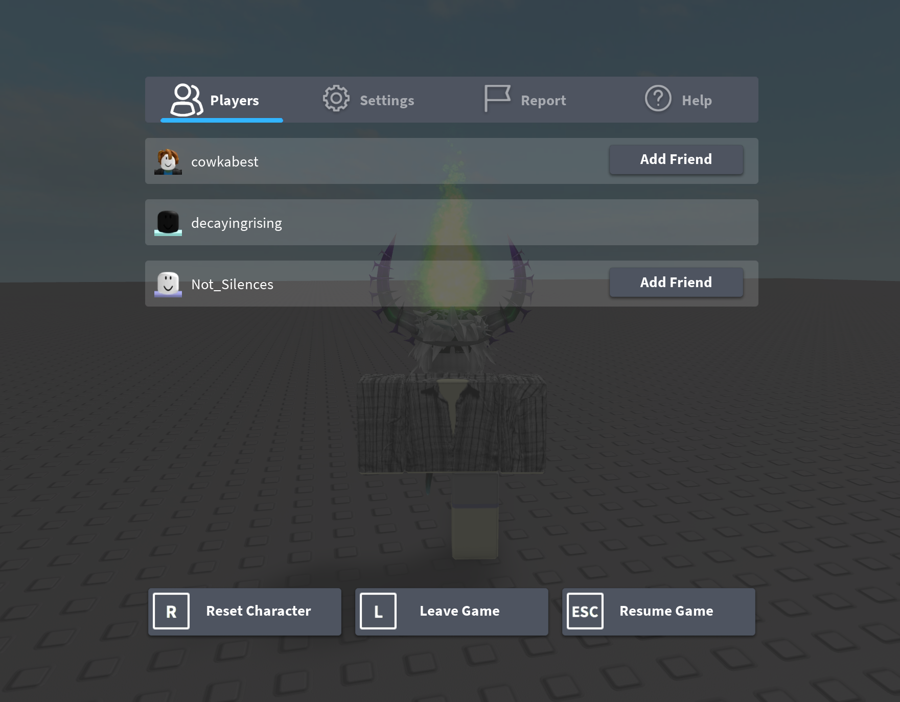
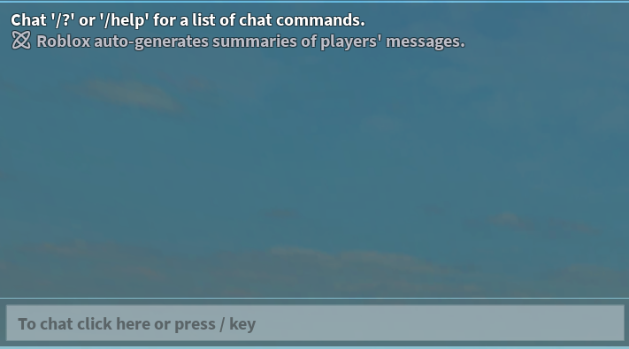
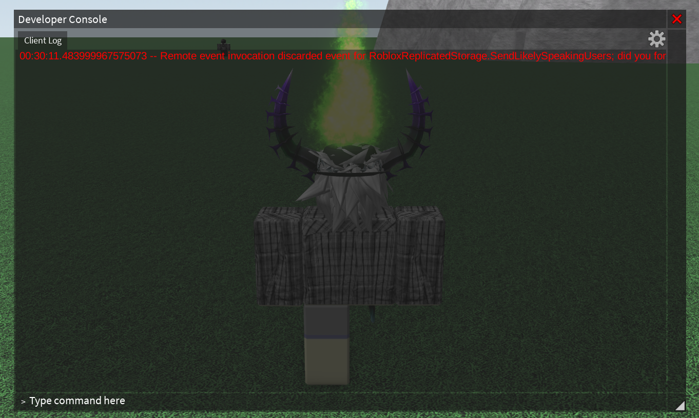
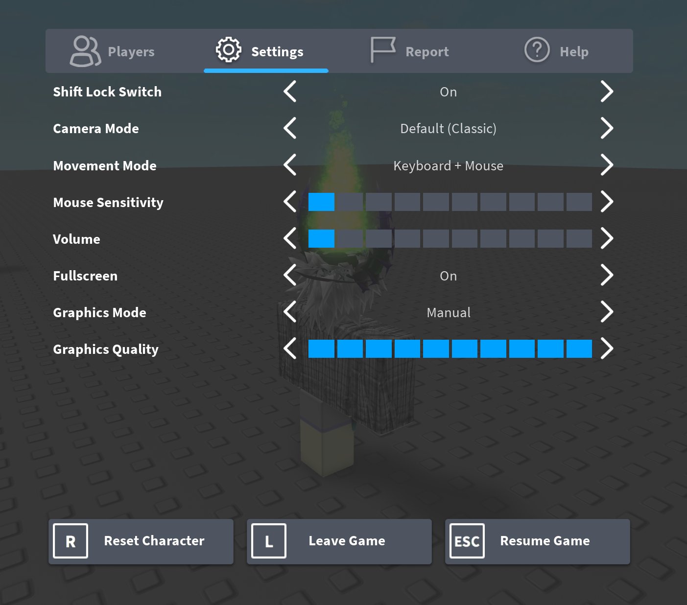
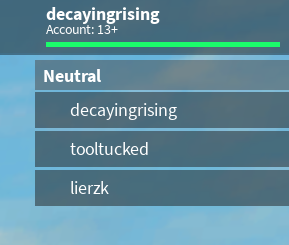
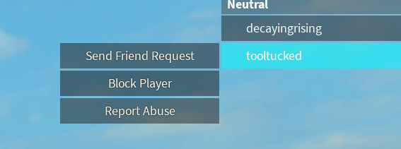
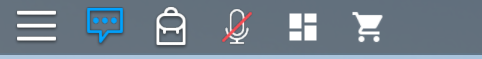

# Project2016

A 2016 CoreGui remake for Roblox


<p align="left">

  <a href="https://github.com/xaviersupreme/Project2016/graphs/contributors">
    
  </a>

  <a href="https://github.com/xaviersupreme/Project2016/issues">
    
  </a>

  <a href="https://github.com/xaviersupreme/Project2016/pulls">
    
  </a>

  <a href="https://github.com/xaviersupreme/Project2016/stargazers">
    
  </a>

  <a href="https://github.com/xaviersupreme/Project2016/network/members">
    
  </a>

  <a href="https://github.com/xaviersupreme/Project2016">
    
  </a>

  <a href="https://github.com/xaviersupreme/Project2016">
    
  </a>
</p>

> [!NOTE]
> Originally by **lxte**, modded by **me**. Inspired by spec / scot.wtf's Project2016.
>
> there WILL be bugs.. 😈 (Make a PR if you find any bugs or want a feature)

## Features

- **2016 Topbar**
- **Old Developer Console** 
- **Old Graphics**
- **Old Bubble Chat**
- **Old Player List**
- **Old escape menu**
- **Custom Topbar Icons**
- **FPS Counter**
- **Old Stud Textures**
- **Old Cursor** 

## Pictures

<p align="center">
  
  
  
  
  
  
  
  
</p>

## Configuration

Edit the `Config2016` table in the script:

```lua
-- [>] Project2016 Loader
-- [!] https://github.com/xaviersupreme/Project2016

if (not game:IsLoaded()) then
	game.Loaded:Wait();
end

getgenv().Config2016 = getgenv().Config2016 or ({
    OldConsole = true,
    OldGraphics = true,
    OldPlayerList = true,
    OldBubbleChat = true,
    OldEscapeMenu = true,

    ReplaceAgeGroupMessage = true,
    HideVoiceChatButton = false,
    HideGameIcons = false,

    FPSCounter = false,
    OldStudTextures = false,
    OldCursor = true,
})

loadstring(game:HttpGet("https://raw.githubusercontent.com/xaviersupreme/Project2016/main/modules/core.lua"))();
```

## Structure

```
Project2016/
|-- loader.lua          # Loader Script
|-- modules/
|   |-- core.lua        # Main CoreGui Modder
|   |-- console.lua     # Old developer console
|   |-- settings.lua    # Old escape menu
|-- README.md << you are here :P
```
